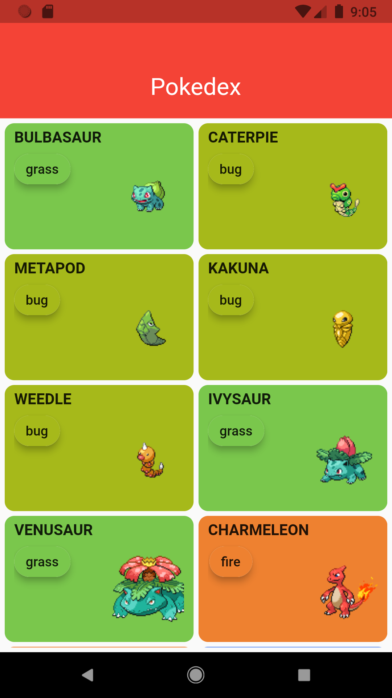

# Pokedex

Projeto criado consumindo dados da API [PokeApi](https://pokeapi.co/).
Este app exibe uma lista de pokemons e quando é clicado em um item desta lista, o app direciona a uma página contendo informações individuais do item clicado.

## Packages:

- [Provider](https://pub.dev/packages/provider)
- [Dio](https://pub.dev/packages/dio)
- [Mocktail](https://pub.dev/packages/mocktail)

